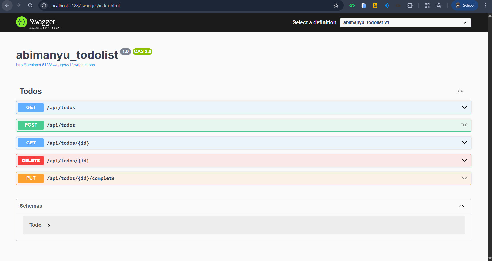

# Todo List API - Technical Test Backend (.NET)

A. Cara Menjalankan Project
Ikuti langkah-langkah berikut untuk menjalankan project di lingkungan lokal Anda:

Pastikan layanan MySQL Anda sudah aktif (misalnya melalui XAMPP atau MySQL Service). 

Lakukan cloning pada repository ini:

```Bash
git clone https://github.com/RzaaStUNS/abimanyu_todolist.git
```
Masuk ke direktori utama project:
```Bash
cd abimanyu_todolist
```
Jalankan aplikasi menggunakan terminal:

```Bash
dotnet run
```


Aplikasi akan berjalan secara otomatis. Anda dapat langsung mencoba seluruh endpoint melalui Swagger UI yang tersedia di:
```bash 
http://localhost:<port>/swagger
```
Dibawah ini ada contoh gambar link port swaggernya


Dibawah ini adalah contoh gambar swagger yang kita buka menggunakan link port localhost kita


B. Versi .NET yang Digunakan
Proyek ini dibangun menggunakan versi LTS (Long Term Support) terbaru: 


.NET 8.0 (x64) 

C. Konfigurasi Database & Migration
Proyek ini menggunakan pendekatan Code-First dengan Entity Framework Core. Anda tidak perlu mengimpor file SQL secara manual karena skema tabel akan dibuat secara otomatis melalui fitur Migration. 


Konfigurasi Koneksi: Buka file appsettings.json dan sesuaikan ConnectionStrings dengan kredensial MySQL lokal Anda. 
```bash
"ConnectionStrings": {
  "DefaultConnection": "Server=localhost;Database=todolistabim_db;User=root;Password=;"
}
```
Update Database: Jalankan perintah berikut di terminal untuk membuat database todolistabim_db dan tabel Todos secara otomatis:
```Bash
dotnet ef database update
``` 
Setelah proses selesai, database siap digunakan untuk menyimpan data Todo Anda.

- Fitur & Validasi
- Async/Await: Seluruh endpoint diimplementasikan secara asinkron untuk performa optimal. 
- HTTP Status Codes: Menggunakan response code standar industri seperti 200 OK, 201 Created, dan 404 Not Found. 
- Data Validation: Dilengkapi dengan validasi untuk memastikan Title tidak kosong sebelum diproses.
